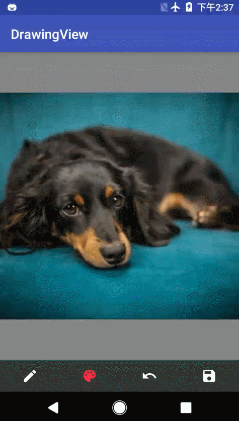
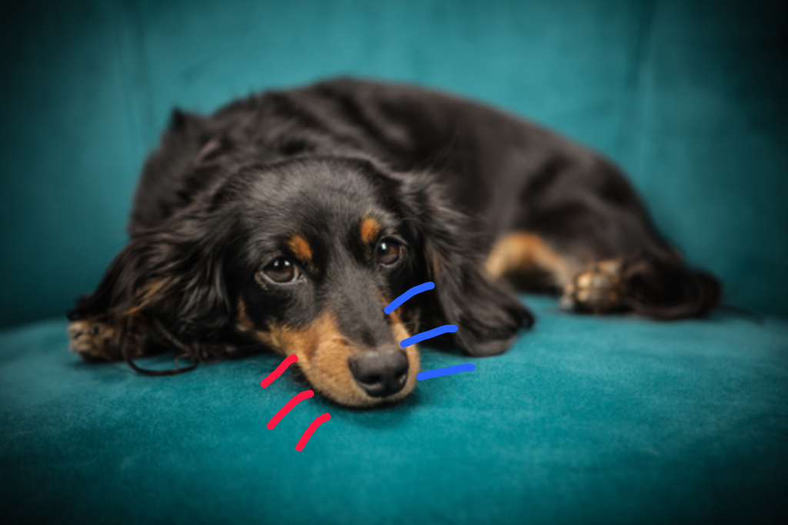

# DrawingView

DrawingView的原型来自[**DrawingView-Android**](https://github.com/mukeshsolanki/DrawingView-Android)，是android的一个可涂鸦控件。

之所以做这个控件是因为前段时间写了一个截图应用需要用到涂鸦功能，现在把涂鸦的控件单独拿出来写一个demo。

这个控件代码超简单的哦，还不到300行。

## 效果展示
gif效果展示：



保存的图片：



## 基本功能

可以设置画笔的粗细，颜色，撤销上一笔涂鸦，提供保存图片的接口。

与[**DrawingView-Android**](https://github.com/mukeshsolanki/DrawingView-Android)相比较，这个版本的控件大小可以适应图片大小和尺寸，去除了“橡皮擦”功能，增加“撤销功能”，解决了在图像上涂鸦路径不能保存的问题。

## 具体实现

### 控件适应图片

因为这个我们需要这个控件居中显示，而且canvas必须和加载的图片一样大（否则可以涂鸦的范围和图片大小不一样）所以在绘制这个控件的时候要测量图片大小。

重写onMeasure()方法

```java
    @Override
    protected void onMeasure(int widthMeasureSpec, int heightMeasureSpec) {
        super.onMeasure(widthMeasureSpec, heightMeasureSpec);

        int widthSize = MeasureSpec.getSize(widthMeasureSpec);
        int heightSize = MeasureSpec.getSize(heightMeasureSpec);

        if (mBitmap != null) {
            // 根据加载的图片尺寸缩放控件，这里只考虑了高大于宽的情况，其他情况请读者自行完善
            if (mBitmap.getHeight() > heightSize) {
                widthSize = heightSize * mBitmap.getWidth() / mBitmap.getHeight();
            } else {
                heightSize = mBitmap.getHeight();
                widthSize = mBitmap.getWidth();
            }
        }
        Log.d(TAG, "onMeasure: heightSize: " + heightSize + " widthSize: " + widthSize);
        setMeasuredDimension(widthSize, heightSize);
    }
```

### 增加撤销功能

思路源于在掘金上看到的一篇文章，具体就是创建一个列表，在每次手指抬起时（`MotionEvent.ACTION_UP`）记录下paint和path，需要“撤销”的时候先清空画布，然后重新加载图片，之后移除列表中的最后一笔，最后把列表中记录的paint和path重绘一次。

**记录画笔和路径**，注意如果你是直接保存mPaint和mPath的话，每次手指下落的时候都要新建这两个对象，不然会导致路径列表里所有路径都是一样的，因为他们保存的对象最终指向同样的内容。

这里我做了一点小改变。不保存mPaint，只保存了mPaint的两个属性，这样就不用每次new Paint()了。

```java
        switch (event.getAction()) {
            case MotionEvent.ACTION_DOWN:
            	// 手指下落 新建Path对象
                mPath = new Path();
                ...
                break;
            case MotionEvent.ACTION_MOVE:
                ...
                mCanvas.drawPath(mPath, mPaint);
                break;
            case MotionEvent.ACTION_UP:
                mPath.lineTo(mX, mY);
                mCanvas.drawPath(mPath, mPaint);
            	// 保存 path和paint的两个属性
                savePath.add(new DrawPath(mPath, mPaint.getColor(), mPaint.getStrokeWidth()));
                mPath = null;
                break;
            default:
                break;
        }
```

**撤销方法**，主要就是清空重绘。

```java
    public void undo() {
        Log.d(TAG, "undo: recall last path");
        if (savePath != null && savePath.size() > 0) {
            // 清空画布
            mCanvas.drawColor(Color.TRANSPARENT, PorterDuff.Mode.CLEAR);
            loadImage(mOriginBitmap);

            savePath.removeLast();

            // 将路径保存列表中的路径重绘在画布上 遍历绘制
            for (DrawPath dp : savePath) {
                mPaint.setColor(dp.getPaintColor());// 还原画笔颜色
                mPaint.setStrokeWidth(dp.getPaintWidth());// 还原画笔粗细
                mCanvas.drawPath(dp.path, mPaint);
            }
            invalidate();
        } else {
            // TODO: 2017/7/12 这里留一个小bug
            // 当第一笔和最后一笔画笔的样式（颜色和宽度）不同的时候，全部撤销后，这时画笔的样式被设置成了和
            // 第一笔一样，此时再绘画使用的是和第一笔一样的样式，而工具栏上我们看到的是最后一笔的样式。
            // UPFATE: 2018/05/31 这里的说明不完全正确
            // 我们需要的是在撤销任意步后，新的画笔颜色和宽度应和当前工具栏上的属性一致。
            // 之前的说法问题在于，我们随时可以更改工具栏上画笔属性，所以新画出来的画笔属性不应和最后一笔一样，
            // 而是要和工具栏上一样。(已修复)
        }
    }
```

注释里面提到了一个小bug，现象和原因和说明了，有兴趣的读者可以自行完善一下这份代码（已解决）。

## 其他

DrawingView中的mDrawMode用来判断当前是不是涂鸦模式。假如你的应用有其他功能模块的话，增加一个模式判断，避免涂鸦功能带来不必要的影响。

DrawingView还提供了getPenSize()和getPenColor()等接口。

更多详情请参考源码。

## 使用方法

使用超简单

### 布局文件中添加控件

```xml
    <FrameLayout
        android:layout_width="match_parent"
        android:layout_height="0dp"
        android:layout_weight="1"
        android:background="@color/translucent">

        <com.hcz017.drawingview.DrawingView
            android:id="@+id/img_screenshot"
            android:layout_width="wrap_content"
            android:layout_width="wrap_content"
            android:layout_gravity="center" />
    </FrameLayout>

```

PS: 因为我们在java代码中设置控件大小随加载的图片变化，所以这里的layout_width和layout_width属性值意义不大。

### 提供的接口

```java
    mDrawingView = (DrawingView) findViewById(R.id.img_screenshot);
    mDrawingView.initializePen();// 初始化画笔
    mDrawingView.setPenSize(10);// 设置画笔大小
    mDrawingView.setPenColor(getColor(R.color.red));// 设置画笔颜色
    mDrawingView.loadImage(bitmap);// 加载图片
    mDrawingView.saveImage(sdcardPath, "DrawImg", Bitmap.CompressFormat.PNG, 100);//保存图片
    mDrawingView.undo();// 撤销上一步
    mDrawingView.getImageBitmap();// 返回控件上的bitmap，可用于保存文件
```

**github地址：**[https://github.com/hcz017/DrawingView](https://github.com/hcz017/DrawingView)

感谢看到这里的大家~